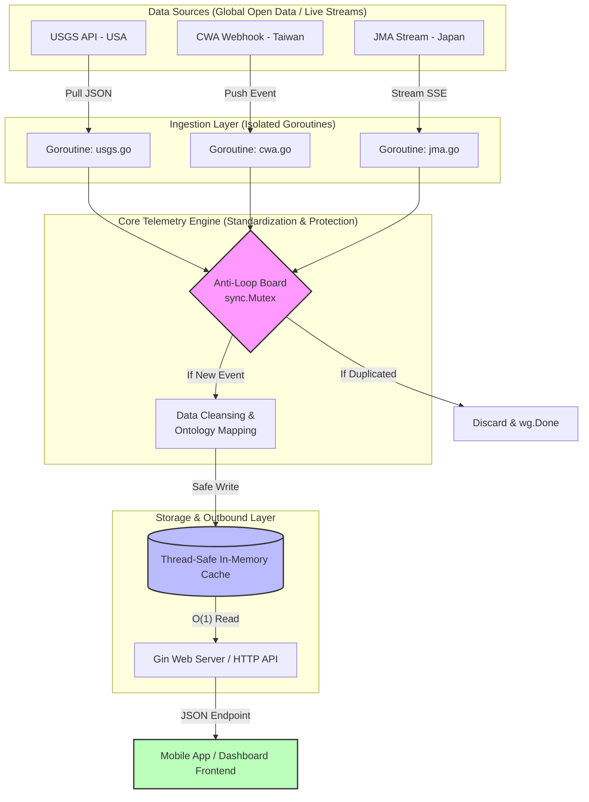

# AegisGeo 🌍

[](https://github.com/chgwyellow/AegisGeo)
[](https://opensource.org/licenses/MIT)

AegisGeo (Shield of the Earth) is an industrial-grade, highly concurrent global natural disaster and geological anomaly monitoring backend engine built in Go.

The system leverages Go's native concurrency primitives (`Goroutines`, `Channels`, `sync.Mutex`, and `sync.WaitGroup`) to simultaneously ingest live, real-time data streams from multiple global meteorological and geological agencies, standardizing heterogeneous raw payloads into a unified stream telemetry cache.

---

## Key Features

- **Multi-Source Concurrent Ingestion**: Spawns independent, isolated Goroutines with deadlock protection to monitor and ingest live HTTP/WebSocket/SSE streams from international agencies (e.g., CWA, USGS, JMA).
- **Idempotent Deduplication (Anti-Loop Defense)**: Utilizes an internal thread-safe tracking memoization table powered by `sync.Mutex` to guarantee no event payload is processed or broadcast twice.
- **Unified Event Ontology**: Cleanses and transforms chaotic, multi-lingual, and format-clashing JSON structures into a highly structured, single-source-of-truth telemetry model.
- **High-Performance In-Memory Cache**: Thread-safe global cache storage ensuring instantaneous `O(1)` read access for downstream consumer applications and mobile APIs.
- **Zero-Dependency Lightweight Binary**: Compiled into a lightweight executable with minimized memory footprint (≈ 15MB under high traffic concurrency), bypassing heavy JVM or Python runtimes.

---

## Architecture & Data Flow

AegisGeo adopts an **Event-Driven Streaming Architecture**. The data pipeline is divided into three isolated layers: **Ingestion**, **Standardization**, and **Storage/API**.



## Project Structure

```text
aegisgeo/
├── cmd/
│   └── server/
│       └── main.go       # Application entrypoint (Initializes global WaitGroup)
├── internal/
│   ├── ingestion/        # Ingestion Layer: Isolated stream workers (usgs, cwa, jma)
│   ├── model/            # Unified Data Domain: Core ontology structs
│   └── store/            # Storage Layer: Thread-safe in-memory cache using sync.Mutex
├── .gitignore            # Strict network/environment production ignore-list
├── go.mod                # Go module definition and dependencies
└── README.md             # System documentation
```

